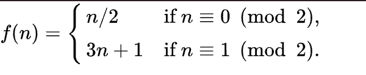

# 51042 - Programming Assignment 0

## Problems

### Problem 1

Open `palindromes/palindromes.py`. You will see a function that has a docstring describing its behavior but no implementation.

Your job is to finish that function to the given specification.

There are two ways to test your code for this problem:

The typical way, which you'll use for most problems: `uv run pytest palindromes/` -- this tells `pytest` to execute all tests in `palindromes`.
We'll discuss this further in class, but tests are functions named `test_*` that exist in files with the same pattern. Open up `test_palindromes.py` to see what this looks like.
**Future tests will usually not be this simple, so it would be a good time to learn what a minimal test looks like.**

You can also use `uv run palindromes/palindromes.py mom cat wow` (replacing the words with any words you choose)
this executes the 'main' function which we have provided. You can change the provided words on the command line to try different sets.
This is provided as an example of how you might choose to test your own code, you might consider writing similar functions in the future.

### Problem 2

Open `stripes/stripes.py` and complete `make_stripes` per the specification.

This time, tests can be run via `uv run pytest stripes/`

There is also a command line interface you can try, for example: `uv run stripes/stripes.py 4 horizontal`.

### Problem 3

The Collatz conjecture is a famous unsolved problem in math that asks if the function

converges on 1 for all initial values of n.

(Source: https://en.wikipedia.org/wiki/Collatz_conjecture)

We're going to implement two functions that will allow us to test given values of n.

Open `collatz/collatz.py`, implement the two functions.

Tip: Keep the difference between `/` and `//` in mind.

Reference: <https://docs.python.org/3/glossary.html#term-floor-division>

To run these tests you can run `uv run pytest collatz`

### Problem 4

This problem has you using loops and conditionals to draw a simple "ASCII art" plant.

The final output will look like this:

You will need to complete the function `make_plant` in `plants/plants.py`.
The docstring will tell you what the function should return.

A few tips:

- Notice that there is a space at the beginning of lines that do not have leaves.
- Remember that the "\n" character creates a new line within a string.
- Your function must **return** a string.

You can test your code with `uv run pytest plants`

You can see the animation once you've completed the function by running `uv run python plants/plants.py`.
